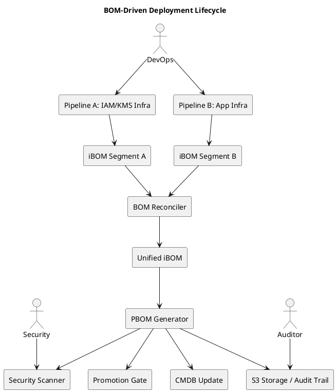

# BOM-Driven Deployment Lifecycle

This document outlines the target architecture for a cloud-native deployment pipeline that leverages Bill of Materials (BOM) artifacts to govern infrastructure and platform deployments across multiple AWS accounts.

## Objective

Build a platform and infrastructure deployment strategy that uses:

- iBOM (Infrastructure BOM)
- SBOM (Software BOM)
- cBOM (Configuration BOM)
- PBOM (Platform BOM — the unified view)

Each BOM serves as a source of truth for what's deployed, how it's related, and whether it's safe and compliant to promote.

---

## BOM Lifecycle Stages

### Stage 1: Terraform State Parsing

- Fetch `.tfstate` from S3, Terraform Cloud, or artifact stores
- Extract all defined resources and their dependencies
- Normalize the output into iBOM components with metadata and `dependsOn` links

### Stage 2: AWS Live Infrastructure Scan

- Use `boto3` or AWS Config to collect real-time AWS resource states
- Include relationship data (e.g., EC2 -> IAM role)
- Normalize live infra data into SBOM-like JSON

### Stage 3: Reconciliation & Graph Merge

- Compare Terraform and live infrastructure BOMs
- Tag resources as:
  - `managed` (exists in both)
  - `orphaned` (exists only in AWS)
  - `stale` (exists only in Terraform)
- Resolve and validate relationships between components

### Stage 4: CycloneDX PBOM Generation

- Merge iBOM, SBOM, and cBOM into a unified PBOM
- Store in S3, DynamoDB, or version-controlled repo
- Feed into:
  - Deployment promotion gates
  - Security scanners
  - Audit/compliance systems
  - Change tracking and rollback

---

## BOM Stack Hierarchy

```
+---------------------------------------------------------+
|                    Platform BOM (PBOM)                 |
|  +------------+  +------------+  +------------+         |
|  |   SBOM     |  |   iBOM     |  |   cBOM     |         |
|  | (Software) |  | (Infra)    |  | (Config)   |         |
|  +------------+  +------------+  +------------+         |
+---------------------------------------------------------+
```

---

## BOM-Driven Deployment Lifecycle (Diagram)



---

## PBOM Output Fields (CycloneDX-compliant)

| Field        | Description                                      |
|--------------|--------------------------------------------------|
| `type`       | Component type (infrastructure, service, etc.)   |
| `bom-ref`    | Unique logical or physical identifier (e.g., ARN)|
| `status`     | `managed`, `orphaned`, `stale`, etc.             |
| `dependsOn`  | List of dependent component references           |
| `properties` | Metadata (region, account ID, tags, ownership)   |

---

## Use Cases Enabled

- Infrastructure and platform promotion gating
- Drift detection between declared and actual state
- Audit trail of deployed components and owners
- Security posture evaluation based on dependency graph
- Graph queries on platform structure (e.g., "who uses IAM role X?")

---
